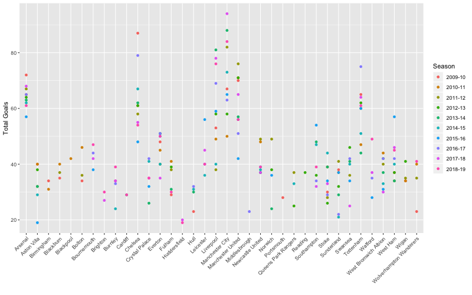
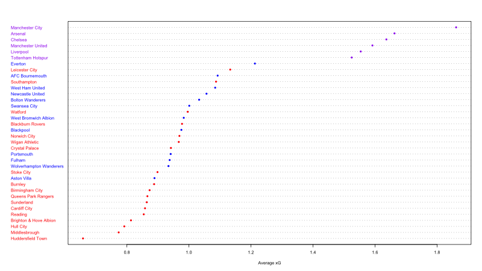

## Introduction
The purpose of this analysis was to understand the relationship between Expected Goals (xG) and a team's Odds of Winning a game in the English Premier League (EPL). I did this by first estimating xG using linear mixed models, and then using those estimates as features in a logit model to predict the odds of winning.

## Data
I used two datasets for the analysis:
1) `whoscored_shots_clean.csv`
2) `footystats_games.csv`

The first dataset (`whoscored_shots_clean.csv`) was scrapped from WhoScored.com and includes detailed offensive statistics for 10 seasons (2009-10 to 2018-19). It includes shots and goals by zones, situations and player physique for 200 observations. For reference, the original dataset is also provided (`whoscored_shots_d.csv`).

The second dataset (`footystats_games.csv`) was obtained from footystats.org and includes detailed game statistics for 13 years (2007-2019) such as goals, shots on target, corners, fouls, and cards. The final version included 2009 observations. 

The datasets, along with their data dictionaries, are provided in the data directory.

## Data Exploration
For the `whoscored_shots_clean.csv` dataset, my response variable was `Total Goals` and calculated by:

* Total Goals = GoalsOutofBox + GoalsPenaltyArea + GoalsSixYardBox - Penalties - OwnGoals 

I removed penalties because they have more than 7 times the average conversion rate of shots in other situations (e.g. Open Play) in the dataset. I also removed own goals because they represent outliers :)

I found that `Total Goals` was right skewed with a slight bimodal distribution. As expected, `Total Goals`varied with both team and season.

For the `footystats_games.csv` dataset, I found many missing values in the the first 5 years (2007-2012), and decided to drop them. In addition, I also dropped any games with teams for which I could not estimate xG from their last season (or lagged xG). In effect, this ignored games with newly promoted teams since their lagged xG could only be estimated by looking at comparable games from the English Football League Championship which was outside the scope of my analysis.

## Expected Goals (xG)
I developed three models to estimate `Total Goals`: Zonal (xG1), Situational (xG2), and Physical (xG3). For each model, I used a set of shot attributes as predictors. The xG models were trained on 10 seasons (2009-10 to 2018-19).

For xG1, I used three different zones (Out of Box, Penalty Area, Six Yard Box); for xG2, I used three different siutations (Open Play, Set Piece, Counter); and for xG3, I used four player body parts (Left Foot, Right Foot, Header, Other).

## Odds of Winning
To estimate the Odds of Winning, I used `HomeTeamWin` as the response variable which was 1 if the Home Team won, and 0 otherwise (draw, loss). The main predictor was `xG` which was the output of one the previous three models. The Odds of Winning models were trained on the past 8 years (2012-2019).

* To calculate `xG` per game, I divided it by 38
* I lagged `xG` by a season
* I controlled for 13 different variables including corners, shots on target, possession, fouls, yellow cards, red cards, possession and pre-match points per game (to account for current form)

## Results
### Expected Goals (xG)

Among the three xG models, I found that xG1 performed best on unexplained variance, AIC and BIC.

* For Zonal xG (xG1), the closer a team is to the goal, the higher its chances of scoring a goal. While the trend holds for both Home and Away teams, scoring Out of Box seems to be problematic for away teams and has a marginally negative estimate, all things equal.  
* For Situational xG (xG2), counters work best for both Home and Away teams. For Home teams, Set Pieces work better than Open Play, whereas for Away teams, the trend is reversed. In absolute terms, Home teams have a clear advantage in Counters and Set Pieces, but trail Away teams in Open Plays. This is surprising given that most Home teams tend to more aggressive than Away teams, and build moves using Open Plays.  
* For Physical xG (xG3), Right Foot and Left Foot are equally good for Home teams, but Left Foot is better than Right Foot for Away teams. This implies that attacking from the left flank may be a better tactic for Away sides. From xG2, I found that Home teams have an advantage in Set Pieces so it's not surprising to find that they maintain their lead in headers, since Set Pieces (corners, freekicks) lead to many headed goals.

### Odds of Winning
All three Odds models were statistically significant, but I found an interesting result:

* The Odds for Away teams are 30 - 40 times higher than those for Home teams, suggesting that a Home team's Odds of Winning are more swayed by an Away team's expectation of scoring based on last season than the Home team's expectation of scoring based on last season!

## Improvements for future analysis
### Dealing with skews better
It is possible that I unintentionally skewed the results by dropping games without xG's for newly promoted sides. Their overall performance would be below average EPL performance, which may undermine the Odds of an Away team's xG from last season. However, it's likely to introduce another skew - that of the competitive difference between EFL Championship and EPL. Indeed, as EPL history shows, a team with a high xG in the EFL is unlikely to maintain it in the EPL, with a few notable exceptions such as Wolves.

### Game-level shots
Most importantly, I can improve the analysis by training xG on shots at game-level. The variance at the season level is likely not enough to capture the variance between different games of a season. In addition, lagging xG by a season further weakens the ability of the models to explain the variance between games.

### Bayesian methods
As a final note, I used xG to estimate how many goals a team will score in a season given the quality of their shots. With the help of Bayesian methods, I can answer the reverse question: Given a shot, which team is most likely to have scored the goal?

### Acknowledgements
Special thanks to Michael Akande (@akandelanre) for his feedback.